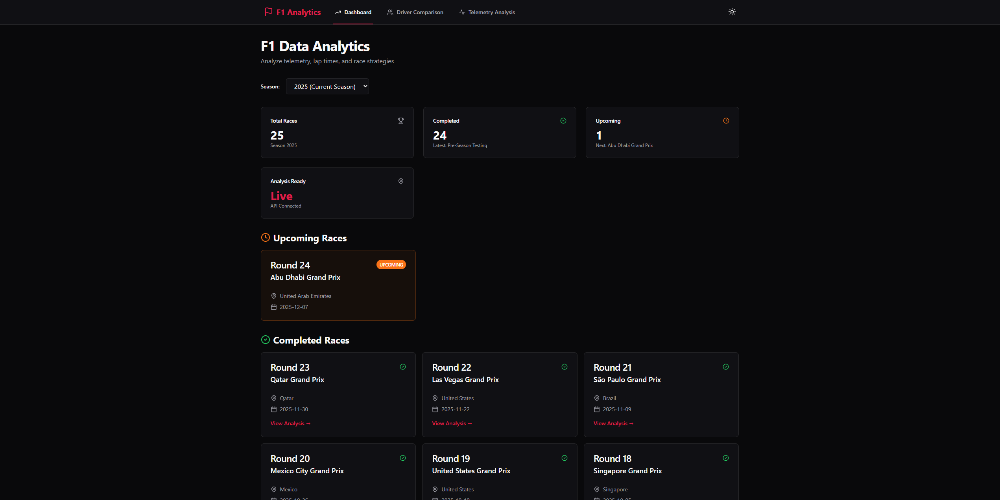
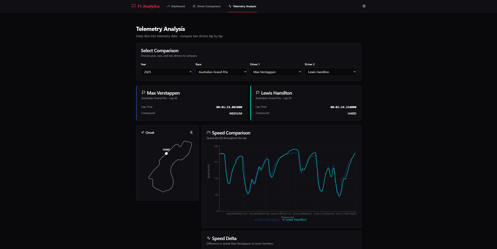
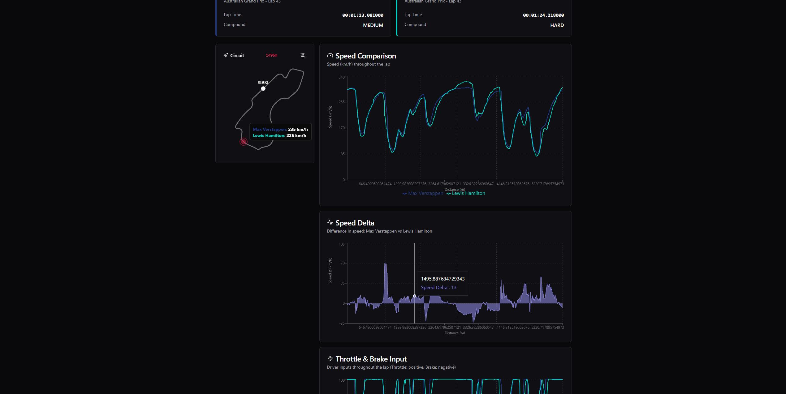
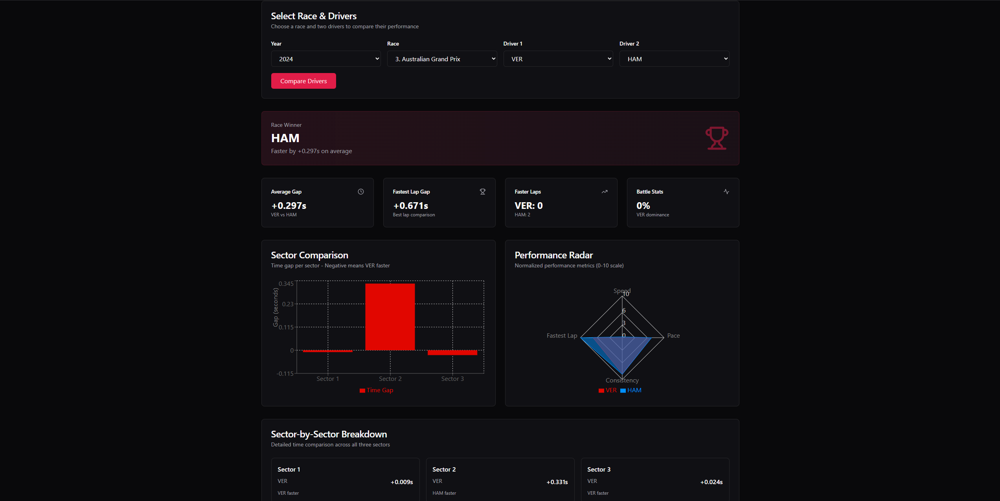

# 🏎️ F1 Data Analytics Platform

Full-stack analytical platform for Formula 1 with real-time telemetry data, interactive visualizations, and comprehensive race analysis. Built with modern web technologies and FastF1 data API.

**Stack:** Python 3.12 · FastAPI · React · TypeScript · FastF1 · Recharts · TailwindCSS

---

## 📸 Screenshots

### Dashboard - Race Overview

*Overview of races with lap times, sector analyses, and real-time statistics*

### Telemetry Analysis - Driver Comparison

*Detailed telemetry comparison between two drivers with synchronized charts (speed, throttle, brake, DRS, gears)*

### Interactive Circuit Layout

*Real track geometry from GPS data with speed visualization at every point*

### Lap Time Analysis

*Comprehensive lap analysis with sector times, tire compounds, and Safety Car detection*

---

## ✨ Features

### Core Functionality
- **Real-time Telemetry Comparison** - Compare speed, throttle, brake, DRS, and gear data between any two drivers
- **Interactive Circuit Visualization** - Explore track layouts with GPS coordinates and speed heatmaps
- **Lap Time Analysis** - Detailed sector breakdown with tire compound tracking
- **Multi-Driver Charts** - Synchronized, interactive charts with zoom and hover capabilities
- **Safety Car & Red Flag Detection** - Automatic detection of race incidents affecting lap times
- **Data Coverage** - Complete telemetry for seasons 2018-2025

### Technical Features
- **Fast Backend Caching** - Session data cached for instant subsequent loads
- **Modern UI/UX** - Dark mode, responsive design, smooth animations
- **Performance Optimized** - Smart data loading and lifecycle management
- **Type Safety** - Full TypeScript frontend with Python type hints in backend

---

## 🚀 Quick Start

### Prerequisites
- Python 3.12+
- Node.js 18+
- Git

### Installation

1. **Clone the repository**
```powershell
git clone https://github.com/dalibor13-co/F1_dataAnalyzer.git
cd F1_dataAnalyzer
```

2. **Backend setup**
```powershell
python -m venv .venv
.\.venv\Scripts\Activate.ps1
pip install -r requirements.txt
```

3. **Frontend setup**
```powershell
cd web\frontend
npm install
cd ..\..
```

4. **Start the application**
```powershell
# Start both backend + frontend
.\start-all.ps1
```

**Endpoints:**
- Backend API: `http://localhost:8000`
- API Documentation: `http://localhost:8000/docs`
- Frontend: `http://localhost:3000`

**Stop services:**
```powershell
.\stop-all.ps1
```

For detailed deployment options (Docker, production), see [DEPLOYMENT.md](docs/DEPLOYMENT.md)

---

## 🔌 API Endpoints

The FastAPI backend provides RESTful endpoints for all F1 data:

**Races:** `GET /races/{year}` - List all races for a season  
**Drivers:** `GET /drivers/{year}/{race}` - Get drivers for specific race  
**Telemetry:** `GET /telemetry/{year}/{race}/{driver1}/{driver2}` - Compare driver telemetry  
**Circuit:** `GET /circuit-layout/{year}/{race}` - Get track GPS coordinates  
**Laps:** `GET /laps/{year}/{race}/{driver}` - Get lap times and sector data

**Interactive API Documentation:** `http://localhost:8000/docs`

---

## 🏗️ Architecture

```
Backend (FastAPI)          Frontend (React + TypeScript)
     ↓                              ↓
FastF1 Data API  →  Cache  →  REST API  →  Interactive UI
     ↓                              ↓
Local File Cache           Recharts Visualizations
```

**Project Structure:**
```
f1-analysis/
├── src/                    # Backend Python code
│   ├── api/                # FastAPI endpoints
│   ├── ingestion/          # FastF1 data loading
│   ├── processing/         # Data transformations
│   ├── analytics/          # Analysis logic
│   └── models/             # Data models
├── web/frontend/           # React frontend
│   └── src/
│       ├── pages/          # Main app pages
│       ├── components/     # Reusable UI components
│       └── lib/            # Utilities
├── data/cache/             # FastF1 local cache
├── tests/                  # Unit tests
└── docs/                   # Documentation
```

---

## 📦 Tech Stack

**Backend:**  
FastAPI · FastF1 · Pandas · Uvicorn · Structlog

**Frontend:**  
React 18 · TypeScript · Vite · Recharts · TailwindCSS · shadcn/ui · Axios

**DevOps:**  
Docker · Docker Compose · PowerShell · pytest

---

## 🧪 Testing

```powershell
# Run all tests
pytest

# Run with coverage
pytest --cov=src tests/
```

---

## 📝 License

MIT

---

## 🙏 Acknowledgments

- [FastF1](https://github.com/theOehrly/Fast-F1) - Excellent F1 data API
- [shadcn/ui](https://ui.shadcn.com/) - Beautiful UI components
- [Recharts](https://recharts.org/) - Powerful React charting library

